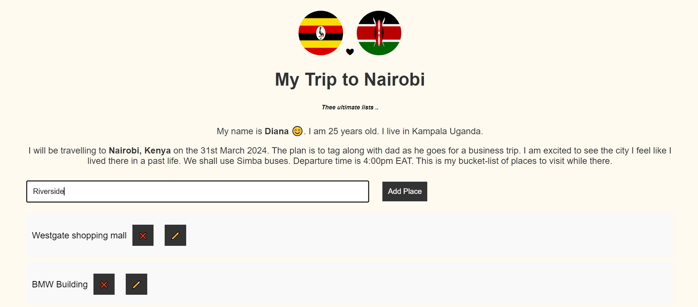

"# my_trip_to_Nairobi" 

This is a simple application that I built using HTML, CSS, and JavaScript. The app allows users to create, manage, and delete places they want to visit while going on a trip in a convenient way.

Features:  

    Add new places to the to-do list.
    Mark places as visited.
    Delete places from the list.
    Responsive design for optimal viewing on various devices.
Usage:  

    Clone the repository to your local machine.
    Open the index.html file in a web browser.
    To add a new task, type the task description in the input field and press Enter.
    To mark a task as completed, click on the checkbox next to the task.
    To delete a task, click on the delete button next to the task.
    Use the filter options at the top to filter tasks by their completion status.

Screenshots

Credits:

This project was created by DIANA NAJJUMA.

License:

This project is licensed under the MIT License - see the LICENSE file for details.